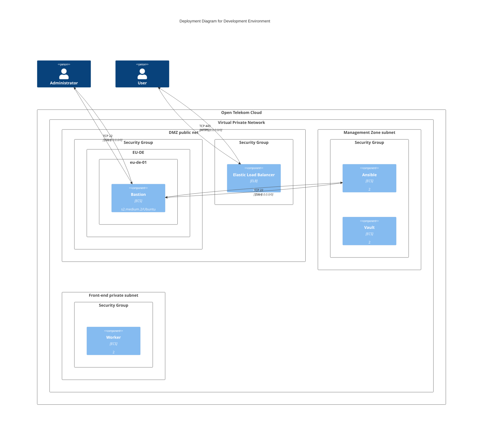
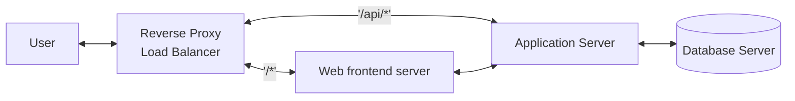

# tfdev_environments

Rel(mobile, spa, "Makes API calls to", "json/HTTPS")
System_Ext(banking_system, "Mainframe Banking System", "Stores all of the core banking information about customers, accounts, transactions, etc.")
Container(mobile, "Mobile App", "Xamarin", "Provides a limited subset of the Internet Banking functionality to customers via their mobile device.")

